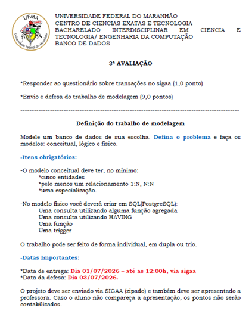
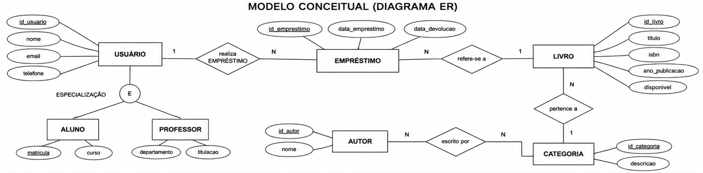
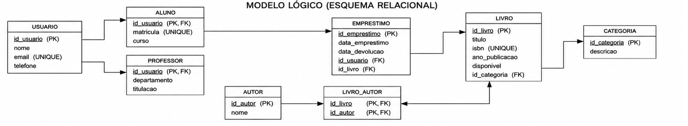
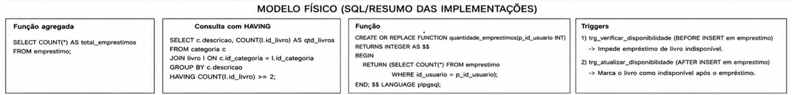
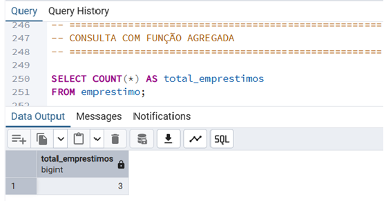
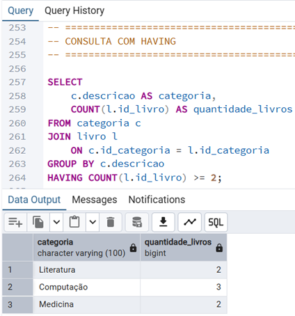
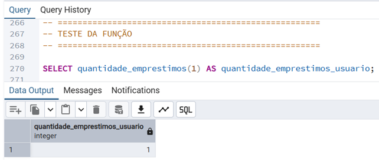
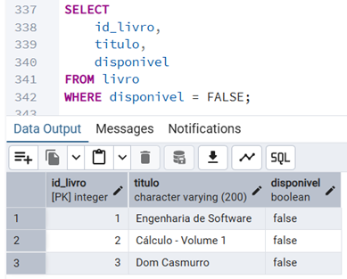
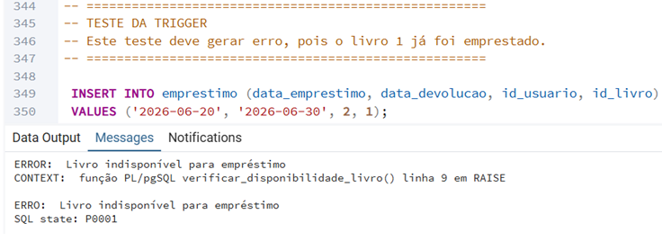

<table align="center">
<tr>
<td align="center" width="25%">

</td>

<td align="center" width="50%">
<strong>Universidade Federal do Maranhão (UFMA)</strong><br>
Centro de Ciências Exatas e Tecnologia (CCET)<br>
Curso de Engenharia da Computação<br>
Disciplina: Banco de Dados (EECP0004)<br><br>

<strong>Discentes:</strong><br>
Renata Costa Rocha<br>
Kaline Maria Carvalho<br>
Guilherme Sameneses de Lima
</td>

<td align="center" width="25%">

</td>
</tr>
</table>

---

# Sistema de Gerenciamento de Biblioteca

<p align="center">
<em>Projeto de modelagem e implementação de banco de dados relacional para gerenciamento de bibliotecas acadêmicas utilizando PostgreSQL.</em>
</p>

<p align="center">


</p>

---

# 1. Descrição do Projeto

O presente projeto consiste na modelagem e implementação de um Sistema de Gerenciamento de Biblioteca utilizando banco de dados relacional.

A proposta contempla todas as etapas clássicas do processo de modelagem de dados, incluindo os modelos conceitual, lógico e físico, bem como sua implementação em PostgreSQL.

O sistema permite o gerenciamento de usuários, livros, autores, categorias e empréstimos, oferecendo mecanismos para controle do acervo bibliográfico e da disponibilidade das obras.

---

# 2. Objetivos

- Modelar um banco de dados utilizando a abordagem Entidade-Relacionamento;
- Aplicar os conceitos da modelagem conceitual na notação de Chen;
- Desenvolver o modelo lógico relacional;
- Implementar o modelo físico em PostgreSQL;
- Utilizar funções e triggers para automatização de regras de negócio;
- Realizar consultas utilizando funções agregadas e cláusula HAVING.

---

# 3. Problema Modelado

Bibliotecas acadêmicas necessitam controlar informações relacionadas a usuários, livros, autores e empréstimos.

O sistema proposto permite:

- Cadastro de alunos e professores;
- Controle do acervo bibliográfico;
- Associação entre livros e autores;
- Classificação dos livros por categoria;
- Registro de empréstimos;
- Controle automático da disponibilidade dos livros.

---

# 4. Requisitos da Atividade

A atividade proposta exigia:

- Modelo Conceitual;
- Modelo Lógico;
- Modelo Físico;
- Mínimo de cinco entidades;
- Relacionamento 1:N;
- Relacionamento N:N;
- Especialização;
- Consulta com função agregada;
- Consulta utilizando HAVING;
- Implementação de função;
- Implementação de trigger.

Todos os requisitos foram atendidos.

## Roteiro da Atividade

<div align="center">

<table>
<tr>
<td align="center">



</td>
</tr>
</table>

<br>

<em><strong>Figura 1.</strong> Roteiro da atividade proposto pela disciplina.</em>

</div>

---

# 5. Modelo Conceitual

O modelo conceitual foi elaborado utilizando a notação de Chen.

### Entidades

- Usuário
- Aluno
- Professor
- Livro
- Autor
- Categoria
- Empréstimo

### Relacionamentos 1:N

- Categoria → Livro
- Usuário → Empréstimo
- Livro → Empréstimo

### Relacionamento N:N

- Livro ↔ Autor

### Especialização

- Usuário → Aluno
- Usuário → Professor

<div align="center">

<table>
<tr>
<td align="center">



</td>
</tr>
</table>

<br>

<em><strong>Figura 2.</strong> Modelo Conceitual do Sistema de Gerenciamento de Biblioteca.</em>

</div>

## Análise do Modelo Conceitual

O modelo conceitual representa uma abstração de alto nível do domínio do problema, descrevendo as principais entidades envolvidas no gerenciamento de uma biblioteca e os relacionamentos existentes entre elas. Desenvolvido utilizando a notação Entidade-Relacionamento (ER) de Chen, esse modelo tem como objetivo capturar os requisitos informacionais do sistema independentemente de aspectos de implementação ou de um Sistema Gerenciador de Banco de Dados (SGBD) específico.

A entidade **Usuário** foi modelada como entidade genérica, permitindo a especialização em **Aluno** e **Professor,** característica que possibilita representar diferentes perfis de usuários mantendo atributos comuns centralizados. Essa abordagem reduz redundâncias e favorece a consistência dos dados.

A entidade **Livro** representa o acervo bibliográfico da biblioteca e está associada à entidade **Categoria** por meio de um relacionamento do tipo 1:N, indicando que uma categoria pode conter diversos livros, enquanto cada livro pertence a apenas uma categoria. Essa estrutura facilita a organização temática do acervo e a realização de consultas específicas.

O relacionamento entre **Livro** e **Autor** foi modelado como N:N, uma vez que um livro pode possuir múltiplos autores e um autor pode participar da elaboração de diversas obras. Esse tipo de relacionamento é fundamental em sistemas bibliográficos e reflete adequadamente a realidade do domínio analisado.

A entidade **Empréstimo** registra as transações realizadas pelos usuários, estabelecendo relacionamentos com as entidades **Usuário** e **Livro.** Essa modelagem possibilita o acompanhamento histórico das movimentações do acervo e constitui a base para o controle de disponibilidade das obras.

Dessa forma, o modelo conceitual fornece uma representação clara e consistente das regras de negócio da biblioteca, servindo como fundamento para as etapas subsequentes de modelagem lógica e implementação física.

---

# 6. Modelo Lógico

O modelo lógico foi obtido a partir da transformação do modelo conceitual para o paradigma relacional.

<div align="center">

<table>
<tr>
<td align="center">



</td>
</tr>
</table>

<br>

<em><strong>Figura 3.</strong> Modelo Lógico do Sistema de Gerenciamento de Biblioteca.</em>

</div>

## Análise do Modelo Lógico

O modelo lógico foi desenvolvido a partir da transformação sistemática do modelo conceitual para o paradigma relacional, preservando todas as entidades, relacionamentos e restrições identificadas durante a etapa de análise.

Nessa fase, cada entidade foi convertida em uma relação (tabela), sendo definidos os respectivos atributos e chaves primárias responsáveis pela identificação única de cada registro. Os relacionamentos do tipo 1:N foram implementados mediante a inclusão de chaves estrangeiras nas tabelas dependentes, garantindo a integridade referencial entre os dados.

O relacionamento N:N existente entre as entidades **Livro** e **Autor** foi transformado em uma tabela associativa denominada **livro_autor,** cuja função é armazenar as associações entre livros e seus respectivos autores. Essa estratégia é amplamente utilizada em bancos de dados relacionais para representar relacionamentos muitos-para-muitos de forma normalizada.

A especialização da entidade **Usuário** em **Aluno** e **Professor** foi implementada por meio de tabelas específicas vinculadas à tabela principal através de chaves primárias compartilhadas, preservando a herança dos atributos comuns e permitindo a representação adequada dos diferentes perfis de usuários.

O modelo lógico resultante encontra-se estruturado de acordo com os princípios da normalização, minimizando redundâncias e reduzindo a possibilidade de inconsistências nos dados armazenados. Além disso, sua organização favorece a manutenção, expansão e consulta eficiente das informações do sistema.

---

# 7. Modelo Físico

O modelo físico foi implementado em PostgreSQL.

### Tabelas Implementadas

- usuario
- aluno
- professor
- categoria
- livro
- autor
- livro_autor
- emprestimo

<div align="center">

<table>
<tr>
<td align="center">



</td>
</tr>
</table>

<br>

<em><strong>Figura 4.</strong> Estrutura física implementada no PostgreSQL.</em>

</div>

## Análise do Modelo Físico

O modelo físico corresponde à implementação concreta do banco de dados no Sistema Gerenciador de Banco de Dados PostgreSQL. Nessa etapa foram definidos os tipos de dados, restrições de integridade, chaves primárias, chaves estrangeiras e demais elementos necessários para garantir a consistência e o desempenho do sistema.

Cada tabela foi criada considerando as características específicas dos dados armazenados. Os identificadores foram implementados por meio de chaves primárias inteiras, enquanto os relacionamentos foram estabelecidos utilizando chaves estrangeiras, assegurando a integridade referencial entre as entidades.

Além das estruturas básicas de armazenamento, o modelo físico incorporou mecanismos de controle de regras de negócio por meio de funções e triggers. Esses recursos permitem que determinadas validações sejam executadas diretamente pelo banco de dados, aumentando a confiabilidade do sistema e reduzindo a dependência de validações externas realizadas pela aplicação.

A implementação física também contempla a estrutura necessária para consultas analíticas e operações de gerenciamento do acervo, permitindo o armazenamento eficiente das informações relacionadas a usuários, livros, autores, categorias e empréstimos.

Dessa forma, o modelo físico materializa os requisitos definidos nas etapas anteriores, transformando a abstração conceitual em uma solução computacional funcional e compatível com ambientes reais de gerenciamento de dados.

---

# 8. Funcionalidades Implementadas

## Consulta com Função Agregada

```sql
SELECT COUNT(*) AS total_emprestimos
FROM emprestimo;
```

### Resultado

<div align="center">

<table>
<tr>
<td align="center">



</td>
</tr>
</table>

<br>

<em><strong>Figura 5.</strong> Resultado da consulta utilizando a função agregada COUNT().</em>

</div>

## Análise da Consulta com Função Agregada

A consulta apresentada utiliza a função agregada **COUNT(),** responsável por contabilizar a quantidade total de registros presentes na tabela de empréstimos. Funções agregadas são amplamente empregadas em bancos de dados relacionais para a obtenção de métricas estatísticas e indicadores operacionais.

Nesse contexto, a consulta permite determinar o volume total de empréstimos registrados no sistema, fornecendo uma visão quantitativa da utilização do acervo bibliográfico. Conforme apresentado na Figura 5, o banco de dados retornou o valor **3,** indicando que três empréstimos foram registrados durante a fase de testes do sistema.

Informações desse tipo podem ser utilizadas para fins administrativos, acompanhamento de desempenho da biblioteca e geração de relatórios gerenciais. A simplicidade da consulta demonstra a capacidade do banco de dados em realizar operações analíticas diretamente sobre os dados armazenados, sem a necessidade de processamento adicional por aplicações externas.

---

## Consulta utilizando HAVING

```sql
SELECT
    c.descricao,
    COUNT(l.id_livro) AS quantidade_livros
FROM categoria c
JOIN livro l
ON c.id_categoria = l.id_categoria
GROUP BY c.descricao
HAVING COUNT(l.id_livro) >= 2;
```

### Resultado

<div align="center">

<table>
<tr>
<td align="center">



</td>
</tr>
</table>

<br>

<em><strong>Figura 6.</strong> Resultado da consulta utilizando HAVING.</em>

</div>

## Análise da Consulta com HAVING

A consulta apresentada utiliza as cláusulas **GROUP BY** e **HAVING** para realizar uma análise agrupada das categorias cadastradas no sistema.

Inicialmente, os registros são agrupados de acordo com a descrição da categoria, permitindo a contagem da quantidade de livros pertencentes a cada grupo. Em seguida, a cláusula **HAVING** atua como um filtro aplicado sobre os resultados agregados, retornando apenas as categorias que possuem duas ou mais obras cadastradas.

Conforme apresentado na Figura 6, as categorias **Literatura,** **Computação** e **Medicina** satisfazem a condição estabelecida pela consulta, possuindo respectivamente 2, 3 e 2 livros cadastrados no sistema.

Diferentemente da cláusula **WHERE,** que atua antes do agrupamento dos dados, a cláusula **HAVING** permite estabelecer condições sobre valores resultantes de funções agregadas, sendo fundamental em consultas analíticas e relatórios estatísticos.

Esse tipo de consulta possibilita identificar categorias com maior representatividade no acervo, contribuindo para análises relacionadas à organização e gestão bibliográfica.

---

## Função

```sql
CREATE OR REPLACE FUNCTION quantidade_emprestimos(p_id_usuario INT)
RETURNS INTEGER
```

Responsável por retornar a quantidade de empréstimos realizados por determinado usuário.

### Resultado

<div align="center">

<table>
<tr>
<td align="center">



</td>
</tr>
</table>

<br>

<em><strong>Figura 7.</strong> Resultado da execução da função <code>quantidade_emprestimos</code>.</em>

</div>

## Análise da Função Implementada

A função armazenada **quantidade_emprestimos()** foi desenvolvida com o objetivo de encapsular uma regra de consulta frequentemente utilizada no sistema. Seu propósito é retornar a quantidade total de empréstimos associados a um determinado usuário, recebendo como parâmetro o identificador correspondente.

Na Figura 7 observa-se a execução da função para o usuário de identificador 1, retornando o valor **1.** Esse resultado indica que o usuário possui um empréstimo registrado no sistema, comprovando o correto funcionamento da rotina implementada.

A utilização de funções armazenadas promove maior reutilização de código, padronização das consultas e simplificação das operações realizadas pelas aplicações que acessam o banco de dados. Além disso, contribui para a centralização da lógica de negócio no próprio SGBD, reduzindo redundâncias e facilitando futuras manutenções.

Do ponto de vista computacional, funções armazenadas representam um importante mecanismo de abstração, permitindo que operações complexas sejam encapsuladas em procedimentos reutilizáveis e executadas de maneira otimizada pelo mecanismo interno do PostgreSQL.

---

## Trigger

### Trigger de Verificação de Disponibilidade

Impede a realização de empréstimos quando o livro já se encontra indisponível.

### Verificação de Livros Indisponíveis

Antes da execução do teste da trigger, foi realizada uma consulta para identificar os livros que tiveram sua disponibilidade alterada automaticamente após o registro dos empréstimos.

<div align="center">

<table>
<tr>
<td align="center">



</td>
</tr>
</table>

<br>

<em><strong>Figura 8.</strong> Livros marcados como indisponíveis após a realização dos empréstimos cadastrados no sistema.</em>

</div>

### Teste da Trigger

Em seguida, foi realizada uma tentativa de registrar um novo empréstimo para um livro já marcado como indisponível. A trigger interceptou a operação e impediu a inserção do registro, retornando uma mensagem de erro ao usuário.

<div align="center">

<table>
<tr>
<td align="center">



</td>
</tr>
</table>

<br>

<em><strong>Figura 9.</strong> Resultado da execução da trigger de verificação de disponibilidade.</em>

</div>

## Análise da Trigger Implementada

A trigger desenvolvida tem como finalidade garantir o cumprimento de uma importante regra de negócio do sistema: impedir que um livro indisponível seja novamente emprestado.

Inicialmente, a Figura 8 demonstra que os livros previamente emprestados tiveram seu atributo **disponivel** atualizado para **FALSE,** evidenciando o funcionamento da trigger responsável pela atualização automática da disponibilidade do acervo.

Posteriormente, conforme apresentado na Figura 9, ao tentar registrar um novo empréstimo para um livro já indisponível, a trigger **verificar_disponibilidade_livro()** foi acionada antes da inserção do registro. Ao detectar que a obra solicitada não estava disponível, a função gerou uma exceção e interrompeu a operação.

A utilização de triggers permite que restrições críticas sejam aplicadas diretamente no banco de dados, garantindo a integridade das informações independentemente da aplicação utilizada para acessar o sistema. Essa abordagem reduz a possibilidade de inconsistências e assegura que as regras de negócio sejam respeitadas em qualquer cenário de utilização.

No contexto do gerenciamento bibliotecário, a trigger implementada desempenha papel fundamental na preservação da consistência do acervo, evitando registros inválidos e contribuindo para a confiabilidade do sistema como um todo.

---

# 9. Tecnologias Utilizadas

- PostgreSQL 17
- SQL
- pgAdmin 4
- Git
- GitHub

---

# 10. Estrutura do Projeto

```text
biblioteca-bd/
│
├── README.md
├── sql/
│   └── biblioteca.sql
├── modelos/
│   ├── conceitual.png
│   ├── logico.png
│   └── resumofisico.png
├── figuras/
│   ├── ufma.png
│   ├── logo.jpg
│   ├── Roteiro.png
│   ├── agregada.png
│   ├── having.png
│   ├── funcao.png
│   └── trigger.png
└── documentos/
```

---

# 11. Considerações Finais

O desenvolvimento deste projeto permitiu aplicar conceitos fundamentais de modelagem de bancos de dados, abrangendo desde a abstração conceitual até a implementação física em PostgreSQL.

Além da construção dos modelos conceitual e lógico, foram explorados recursos avançados do banco de dados, como funções, triggers e consultas analíticas, contribuindo para a consolidação dos conhecimentos adquiridos na disciplina.

O trabalho atendeu integralmente aos requisitos propostos, contemplando relacionamentos 1:N e N:N, especialização, consultas avançadas e mecanismos de automação por meio de funções e triggers.

---

# 12. Contato

### Renata Costa Rocha
📧 renata.rocha@discente.ufma.br

### Kaline Maria Carvalho
📧 carvalho.kaline@discente.ufma.br

### Guilherme Sameneses de Lima
📧 guilherme.sameneses@discente.ufma.br

---

**Universidade Federal do Maranhão (UFMA)**  
**Curso de Engenharia da Computação**  
**Disciplina: Banco de Dados (EECP0004)**